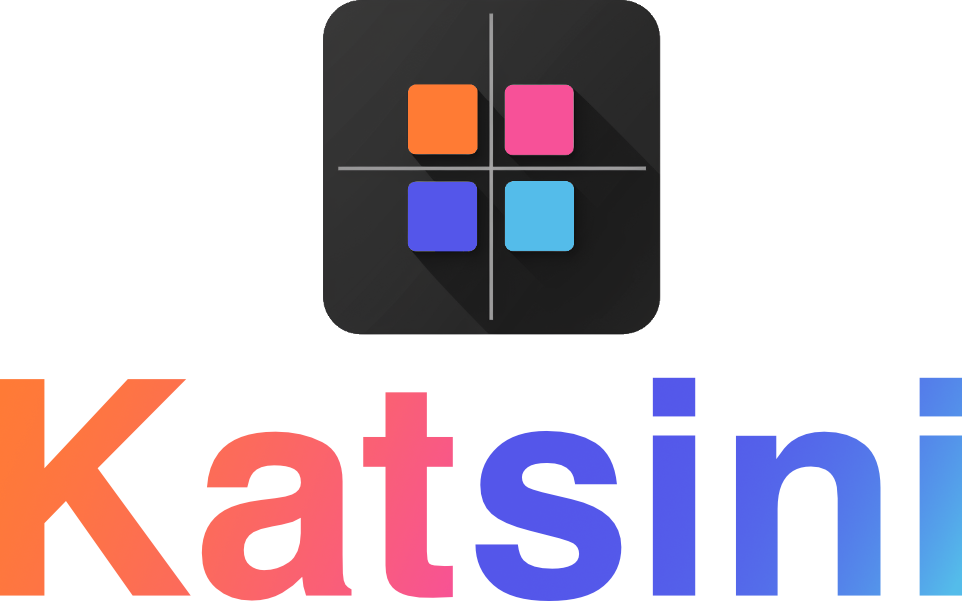

# Katsini - Get the latest app info from app stores
<br />
<div align="center">
    
    <br /><br />
</div>
<p>A blazing-fast, lightweight, and user-friendly tool built with <a href="https://golang.org">Go</a> for retrieving app information from major app stores.</p>

[](https://go.dev/)

[](https://github.com/arisecode/katsini/releases)
[](https://codecov.io/gh/arisecode/katsini)
[](https://github.com/arisecode/katsini/issues)


## 🍕 Features
- ⚡️ **Blazingly fast** — Lightning-quick app data retrieval powered by Go
- 🛍️ **Multi-store support** — Fetch data from major app stores in one place
- 🪶 **Lightweight** — Minimal resource footprint for efficient operation
- 🐳 **Containerized** — Full Docker support for flexible deployment
- 🔌 **Simple API** — Clean REST endpoints for seamless integration
- 📝 **Structured data** — Consistent JSON output for all app stores
- 🛠️ **Easy setup** — Get started in minutes with straightforward configuration

## 🛍️ Supported App Stores
- ✅ [Google Play Store](https://play.google.com/store)
- ✅ [Apple App Store](https://apps.apple.com)
- ✅ [Huawei AppGallery](https://appgallery.huawei.com)

## 🐳 Quick Start

Katsini comes with Chrome bundled in the container - no separate services or configuration needed!

```bash
docker run -p 8080:8080 ghcr.io/arisecode/katsini:latest
```

🎉 That's it! You can now access the service at `http://localhost:8080`

**Note:** Chrome is automatically bundled with anti-bot protection. Just run the single container and you're ready to go!

## 📖 Usage

### 🛍️ Google Play Store
#### Example Request:
- **URL:** `http://localhost:8080/playstore`
- **Method:** `GET`
- **Query Parameter:**
    - `bundleId` (**REQUIRED**): The app package name (e.g., `com.mediocre.dirac`).
    - `lang` (optional, defaults to `'**en**'): The two letter language code in which to fetch the app page.
    - `country` (optional, defaults to '**us**'): The two letter country code used to retrieve the applications. Needed when the app is available only in some countries.
```bash
curl http://localhost:8080/playstore?bundleId=com.mediocre.dirac&lang=en&country=us
```
#### Example Response:
```json
{
  "bundleId": "com.mediocre.dirac",
  "developer": "Mediocre",
  "title": "Beyondium",
  "updated": "31-10-2019",
  "url": "https://play.google.com/store/apps/details?id=com.mediocre.dirac&hl=en&gl=us",
  "version": "1.1.5"
}
```

### 🛍️ Apple App Store
#### Example Request:
- **URL:** `http://localhost:8080/appstore`
- **Method:** `GET`
- **Query Parameter:**
    - `appId` or `bundleId` (**REQUIRED**):
      - `appId`: The unique identifier for the application in the Apple App Store. This can be found in the app's store URL after the `/id<APP_ID>` segment.
      - `bundleId`: The app package name (e.g., `com.thinkdivergent`).
    - `country` (optional, defaults to '**us**'): The two letter country code used to retrieve the applications. Needed when the app is available only in some countries.
```bash
curl http://localhost:8080/appstore?appId=1592213654&country=us
```
#### Example Response:
```json
{
  "appId": "1592213654",
  "bundleId": "com.thinkdivergent",
  "developer": "Think Divergent LLC",
  "title": "Think Divergent",
  "updated": "11-02-2023",
  "url": "https://apps.apple.com/us/app/think-divergent/id1592213654?uo=4",
  "version": "2.0.13"
}
```

### 🛍️ Huawei AppGallery
#### Example Request:
- **URL:** `http://localhost:8080/appgallery`
- **Method:** `GET`
- **Query Parameter:**
    - `appId` (**REQUIRED**): The unique identifier for the application in the Huawei AppGallery. This can be found in the app's store URL after the `/app/C<APP_ID>` segment.

**⚠️ Important for VPS/Datacenter Deployments:**

Huawei AppGallery actively blocks requests from datacenter/VPS IP addresses, returning empty pages even though the app exists. If you're deploying on a VPS (AWS, DigitalOcean, Vultr, etc.) and experiencing issues where apps return empty results or "app not found" errors, you **must** configure the API fallback:

1. Register at [Huawei Developer Console](https://developer.huawei.com/consumer/en/console)
2. Create an app/project and enable AppGallery Publishing API
3. Get your OAuth2 credentials (Client ID and Client Secret)
4. Set environment variables:
   ```bash
   docker run -p 8080:8080 \
     -e HUAWEI_CLIENT_ID="your_client_id" \
     -e HUAWEI_CLIENT_SECRET="your_client_secret" \
     ghcr.io/arisecode/katsini:latest
   ```

The application will automatically fallback to the official Huawei API when scraping fails, bypassing IP restrictions.
```bash
curl http://localhost:8080/appgallery?appId=100102149
```
#### Example Response:
```json
{
  "appId": "100102149",
  "bundleId": "com.radio.fmradio",
  "developer": "RADIOFM",
  "title": "Radio FM",
  "updated": "05-11-2024",
  "url": "https://appgallery.huawei.com/app/C100102149",
  "version": "6.5.6"
}
```

## ⚡ Benchmarks
The benchmarks were run using the following command:
```bash
go test -bench=. -benchtime=1s -benchmem -cpu=1
```
The results of the benchmarks are as follows:
```bash
goos: linux
goarch: amd64
pkg: github.com/arisecode/katsini
cpu: 12th Gen Intel(R) Core(TM) i7-12700
BenchmarkGooglePlayStore  	       2	 811015314 ns/op	 3816876 B/op	   21807 allocs/op
BenchmarkAppleAppStore    	      64	  18702830 ns/op	   95091 B/op	     163 allocs/op
BenchmarkHuaweiAppGallery 	       2	 892189872 ns/op	 2685124 B/op	   15531 allocs/op
```
The benchmark results show the average time taken and how many iterations were run per operation can be done in a second.
- **Note:** The benchmarks were run on a 12th Gen Intel(R) Core(TM) i7-12700 CPU and using a single CPU core.
-  `2` : The number of iterations run per operation.
- `ns/op` : The average time taken for each operation.
- `B/op` : The average number of bytes allocated per operation.
- `allocs/op` : The average number of memory allocations per operation.

## 🔒 Anti-Bot Protection

Katsini uses [chromedp-undetected](https://github.com/Davincible/chromedp-undetected) to bypass basic anti-bot detection mechanisms. This helps ensure reliable data fetching from app stores that implement bot protection.

**Features:**
- 🛡️ Automatic stealth mode when available
- 🔄 Graceful fallback to regular chromedp on unsupported platforms
- 🤖 Mimics real browser behavior to avoid detection
- ⚡ No performance impact on regular operations

**Note:** The undetected mode works best in Linux environments with headless Chrome. On macOS and other platforms, it automatically falls back to standard chromedp mode.

## 🔋 Uses
Here are some of the libraries that are used in this project:
- [Chromedp](https://github.com/chromedp/chromedp) - A faster, simpler way to drive browsers in Go.
- [chromedp-undetected](https://github.com/Davincible/chromedp-undetected) - Anti-bot detection bypass for chromedp.
